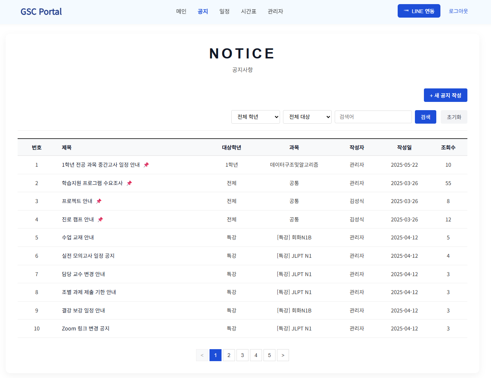
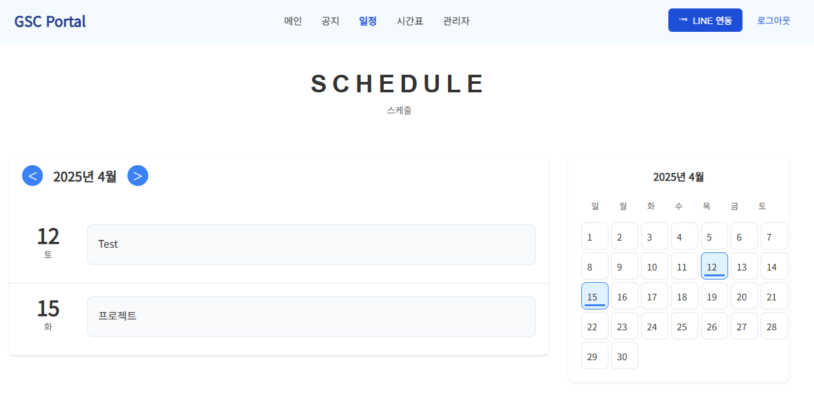
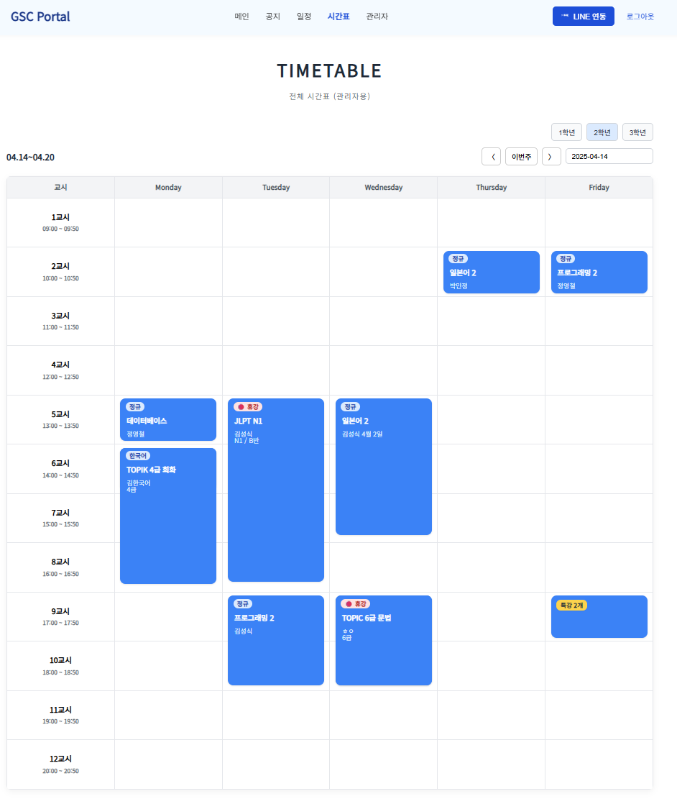
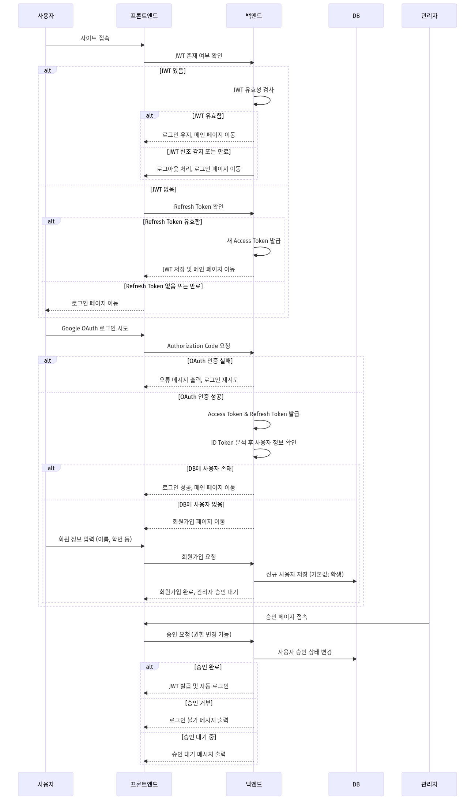
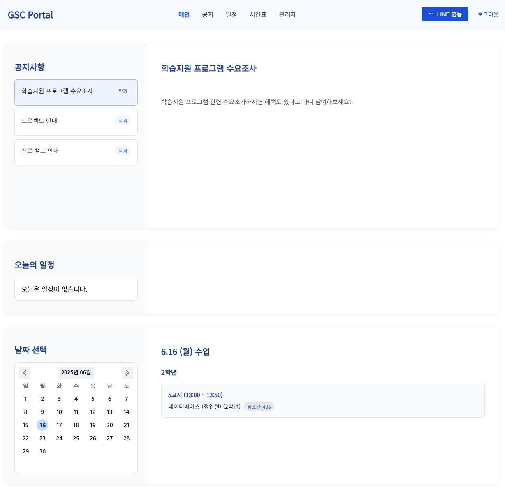

# 📘 GSC Portal（個人開発版）

このプロジェクトの README は日本語と韓国語で提供いたします。
이 프로젝트의 README는 한국어와 일본어로 제공됩니다.

- [日本語 (Japanese)](README_gscportal_personal.md)
- [한국어 (Korean)](README_gscportal_personal_ko.md)

---

## 目次

1. [プロジェクト概要](#プロジェクト概要)
2. [主な機能](#主な機能)
3. [ユーザーフロー](#ユーザーフロー)
4. [役割別機能](#役割別機能)
5. [システム構成](#システム構成)
6. [技術スタック](#技術スタック)
7. [技術的課題と改善点](#技術的課題と改善点)
8. [開発期間・貢献度](#開発期間・貢献度)
9. [ローカル実行方法](#ローカル実行方法)

---

## プロジェクト概要

GSC Portal は、英進専門大学グローバルシステム融合学科の学生・教員向けに開発した
**学科専用ポータルシステム**です。

学科内では公知・時間割・日程などの情報が分散しており、
必要な情報を探すのに手間がかかるという課題がありました。
また、既存の汎用ツールでは学年別の管理や学科固有の運用フローに対応しきれない場面も多くありました。

この問題を解決するために、
Vue 3 + Node.js + MySQL をベースとした学科専用ポータルの開発を個人で開始しました。

単なる掲示板システムにとどまらず、
Google Calendar や LINE との外部 API 連携を組み込むことで、
**通知・共有の自動化**を実現した実用性の高いシステムを目指しました。

---

## 主な機能

### 公知事項管理

学年別フィルタリングと検索機能により、
必要な情報を素早く見つけられる掲示板システムです。

- 学年別公知フィルタリング・キーワード検索
- 公知のピン固定・ファイル添付・プレビュー対応
- Google Calendar への日程自動登録オプション
- LINE Messaging API による自動通知送信

**例:**



---

### 日程管理

Google Calendar API と連携し、
月間・週間ビューで学科の日程を一元管理します。

- 月間 / 週間 UI での日程確認
- 日程の登録・修正・削除
- Google Calendar API 連携による外部同期

**例:**



---

### 時間割管理

学年ごとの週間時間割を視覚的に表示し、
特別講義・休講などの状態を直感的に把握できます。

- 学年別週間時間割の表示
- 時限の結合表示・特別講義 / 休講の視覚的区別
- 管理者専用の時間割登録・修正機能

**例:**



---

### ユーザー認証・権限管理

大学ドメインに限定した Google OAuth ログインにより、
外部ユーザーのアクセスを防止します。

- Google OAuth ログイン（g.yju.ac.kr ドメイン限定）
- 新規ユーザーは登録後に管理者承認が必要
- JWT ベースの自動ログイン・トークン更新
- 学生 / 教員 / 管理者の権限別機能制御

**シーケンス図:**



---

## ユーザーフロー

1. ユーザーが Google ログインを試みる
2. 既存ユーザーはそのままメインページへ遷移
3. 新規ユーザーは登録フォームを記入し、管理者の承認を待機
4. 管理者が承認後、自動ログインしてダッシュボードへ遷移

**メイン UI 例:**



---

## 役割別機能

| 機能               | 学生 | 教員 | 管理者 |
|--------------------|------|------|--------|
| 公知閲覧           | ✅   | ✅   | ✅     |
| 公知作成・修正     | ❌   | ✅   | ✅     |
| 掲示物フィルタリング | ✅  | ✅   | ✅     |
| 時間割閲覧         | ✅   | ✅   | ✅     |
| 時間割修正         | ❌   | ✅   | ✅     |
| 会員承認           | ❌   | ❌   | ✅     |

---

## システム構成

フロントエンド・バックエンド・データベースを明確に分離した
**3 層アーキテクチャ**で設計されています。

### Frontend (Vue 3)
- Pinia による状態管理
- SCSS によるスタイリング
- ルートガードによる権限制御

### Backend (Node.js / Express)
- JWT 発行・検証ミドルウェア
- Google OAuth 2.0 認証フロー
- Google Calendar API・LINE API 連携モジュール

### Database (MySQL)
- ユーザー・公知・日程・時間割のリレーション設計
- セッション管理テーブル

---

## 🛠 技術スタック

- **Frontend**: Vue 3, Vite, Pinia, SCSS
- **Backend**: Node.js, Express, JWT
- **Database**: MySQL
- **Infra & API**: Google Calendar API, LINE Messaging API

---

## 技術的課題と改善点

### Google OAuth のドメイン制限

一般的な Google ログインでは、誰でもアクセスできてしまう問題がありました。

→ メールドメインを `g.yju.ac.kr` に限定し、
さらに管理者承認フローを追加することで、
不正アクセスを二重に防止する仕組みを構築しました。

---

### JWT トークン管理

アクセストークンの有効期限が切れるたびに再ログインが必要になる
UX の問題がありました。

→ リフレッシュトークンを導入し、
アクセストークンの自動更新を実装することで、
ユーザーが意識せずにセッションを維持できるようにしました。

---

### 外部 API 連携の複雑性

Google Calendar と LINE の 2 つの外部 API を同時に管理する必要があり、
エラーハンドリングと認証情報の管理が複雑になりました。

→ 各 API のラッパーモジュールを分離し、
サービス層で統一的に呼び出せる構成に整理しました。

---

## 学び

本プロジェクトを通じて、
機能実装だけでなく、
初期設計がシステム全体に大きく影響することを学びました。

認証・権限管理などの基盤設計が
サービスの拡張性に直結することを実感し、
設計段階での意思決定の重要性を強く意識するようになりました。

また、複数の外部 API を個人で統合・運用する経験を通じて、
モジュール分離やエラーハンドリングといった
**保守性を意識した設計**の必要性を実践から学びました。

---

## 開発期間・貢献度

- **期間**: 2024.12 ~ 2025.04（計 5 ヶ月）
- **貢献度**: 100% 個人開発
- 実使用シナリオに合わせた構造設計・機能拡張を中心に開発

---

## ローカル実行方法

```bash
# 1. プロジェクトのクローン
git clone https://github.com/Gapsick/gsc-portal-personal.git

# 2. フロントエンドの起動
cd frontend
npm install
npm run dev

# 3. バックエンドの起動
cd backend
npm install
npm run start
```
